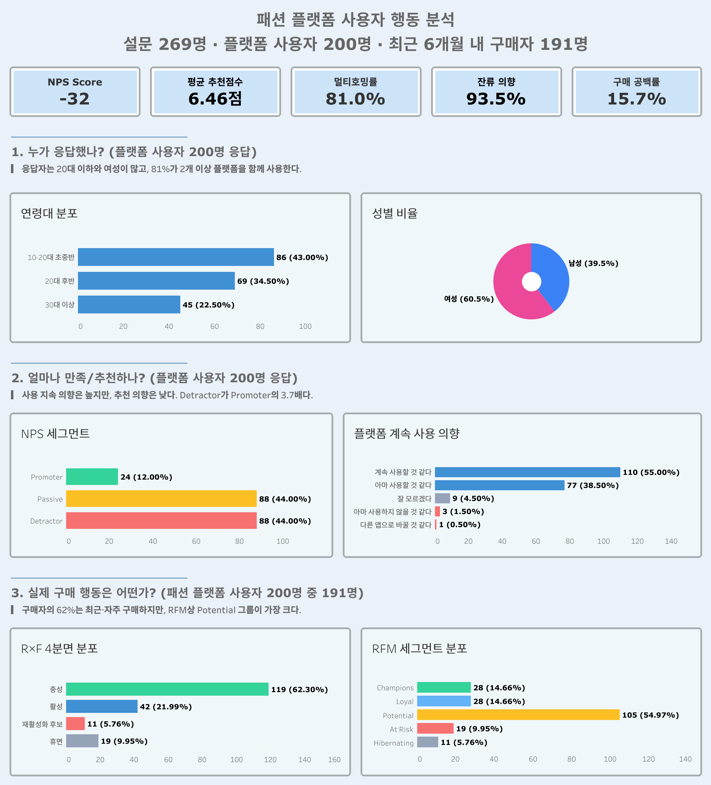
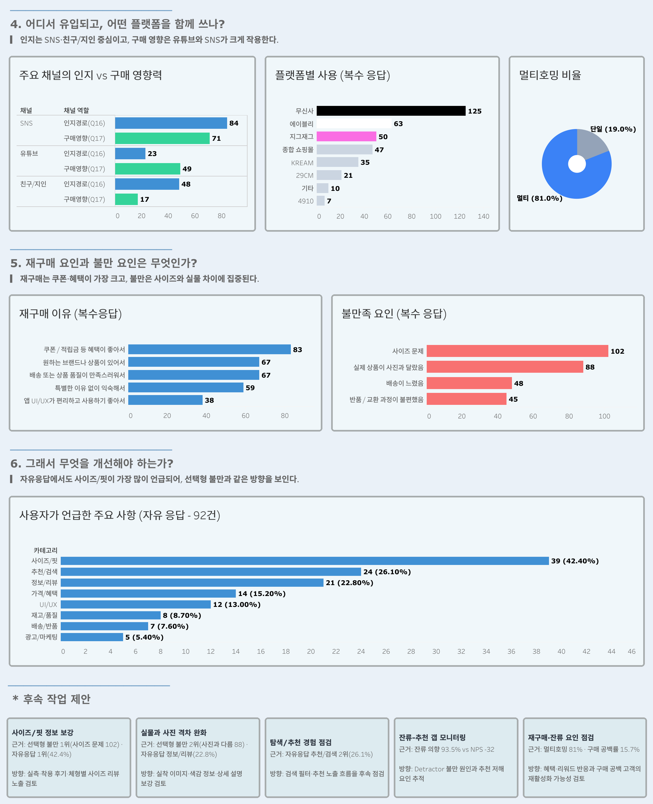

# 패션 플랫폼 사용자 행동 분석

직접 수집한 설문 데이터로 패션 플랫폼 사용자의 **추천 의향(NPS)·구매 행동·잔류 강도·UX 불만 요인**을 연결해 분석하고, 개선 우선순위를 도출한 데이터 분석 프로젝트.

---

## 프로젝트 배경

**왜 이 설문을 시작했나**
패션 앱은 무신사·에이블리·지그재그처럼 여러 개를 함께 쓰는 모습이 흔하고, 다른 앱으로 갈아타는 부담도 크지 않다. 그렇다면 사용자는 왜 특정 플랫폼에 남고, 적극적으로 추천하지도 않으면서 왜 계속 쓰는 걸까. 이 질문은 외부에서 행동 로그로 확인할 수 없어, 사용자에게 직접 물어보기로 했다 — 추천 의향(NPS), 실제 구매 행동, 불만을 한 설문에서 함께 본 이유다.

**어떻게 풀었나**
추천 의향(NPS)을 출발점으로 ① 실제 구매 행동과의 연결 → ② 설문 기반 RFM으로 우선 케어 대상 분리 → ③ 자유응답으로 UX 병목 식별 순서로, 의향·행동·텍스트를 한 흐름에서 교차 검토했다.

**그래서, 무엇을 알게 됐나**
낮은 NPS(−32.0)가 곧 이탈을 뜻하지는 않았다. 다수는 불만이 있어도 익숙함·혜택 때문에 남는 **소극적 잔류층**에 가까웠다. 개선 우선순위는 단순 이탈 방어가 아니라 다음 순서로 정리된다.

| 우선순위 | 무엇을 | 근거 |
|---|---|---|
| 1 | 사이즈/핏·정보 신뢰성 개선 (세그먼트 공통 UX 병목) | 자유응답 92건 중 사이즈/핏 42.4%로 최다 |
| 2 | 객단가 신호 높은 재활성화 후보 우선 관찰 | 설문 기반 RFM에서 별도 분리 |
| 3 | 소극적 잔류층을 만족 사용자로 전환 | NPS는 낮으나 잔류 의향 93.5% |

> ⚠️ 자기보고 단면 설문 기반이므로 확정된 인과가 아니라 **방향성·우선순위 제안**이다. 실제 매출·행동 로그와의 검증은 후속 과제다.

---

## 대시보드

분석 결과(01–07)를 Tableau로 종합한 6섹션 대시보드. 왼쪽 → 오른쪽 순으로 이어진다.

<p align="center">
  
  <br>
  
</p>

전체 PDF 버전은 [설문조사_대시보드.pdf](설문조사_대시보드.pdf) 참고.

---

## 폴더 구조

```
.
├── README.md
├── assets/         # README용 대시보드 이미지
├── docs/           # 변수·세그먼트 정의·통계 방법론·SQL 워크플로
├── notebooks/      # 01–07 분석 노트북 + 08 전체 요약
├── sql/            # 03–07 분석 쿼리
├── tableau/        # 대시보드 추출용 SQL·스크립트 (데이터 CSV는 비공개)
├── 설문조사_대시보드.pdf
└── .env.example
```

---

## 데이터 개요

| 항목 | 내용 |
|------|------|
| 수집 방식 | Google Forms 직접 설문조사 (자기보고·단면, 편의표집) |
| 수집 기간 | 2026-04-25 ~ 2026-05-16 |
| 응답 수 | 원본 269명 → 정제 **266명**(논리 모순 3건 제외) → 플랫폼 사용자 **200명** → 최근 6개월 내 구매자 **191명** |
| 표본 특성 | 10–30대 95.1%, 20대 72.9% 중심 |
| 저장 | MySQL `fashion_platform.survey` |

> ⚠️ **개인정보 보호** — 원본 설문 CSV에는 추첨용 이메일이 포함되어 있어 공개 저장소에 올리지 않는다(`raw_data/`는 `.gitignore` 처리). 분석 데이터셋(MySQL)에서는 이메일을 제거했다. 노트북은 정제된 `survey` 테이블을 기준으로 동작한다.

---

## 핵심 인사이트

1. **NPS는 낮지만 즉시 이탈 의향자는 많지 않다** — NPS −32.0 (Promoter 12.0% / Passive 44.0% / Detractor 44.0%)이나 잔류 의향은 93.5%로, 불만이 있어도 남는 소극적 잔류층이 다수다. _(`03_nps`)_
2. **추천 의향은 행동과 연결되나 단독 예측 변수는 아니다** — NPS는 계속 사용 의향·구매 빈도와 약하게 연결되지만, 혜택·익숙함·멀티호밍이 함께 작동한다. _(`04_retention_and_behavior`)_
3. **Survey-based RFM으로 객단가 신호 높은 재활성화 후보를 분리할 수 있다** — 재활성화 후보 안에서도 과거 객단가가 높은 하위 그룹(Can't Lose 후보)이 구분된다. _(`05_segmentation`)_
4. **사이즈/핏이 핵심 불만, 추천/검색·정보 신뢰성이 뒤를 잇는다** — Q18 자유응답 92건 중 사이즈/핏 42.4% > 추천/검색 26.1% > 정보/리뷰 22.8%, NPS 세그먼트와 무관한 공통 이슈다. _(`07_text_analysis`)_
5. **멀티호밍은 충성도 분산이 아니라 고관여 신호에 가깝다** — 여러 플랫폼 동시 사용자는 단일 사용자보다 NPS·구매 빈도가 더 높은 경향을 보인다. _(`06_channel`)_

---

## 분석 구조

| 번호 | 노트북 | 내용 |
|------|--------|------|
| 01 | `01_cleaning.ipynb` | 정제·타입 변환·정규화·논리 모순 검사·MySQL 적재 |
| 02 | `02_eda.ipynb` | 표본 신뢰도·내적 일관성·인구통계·플랫폼 사용·구매 행동 |
| 03 | `03_nps.ipynb` | NPS 세그먼트별 재구매 이유·계속 사용 의향·불만족 경험 |
| 04 | `04_retention_and_behavior.ipynb` | 의향–행동 정합성 + R×F 구매 활동 매트릭스 |
| 05 | `05_segmentation.ipynb` | 룰 기반 RFM 세그먼트 + Potential 세분화 + Can't Lose |
| 06 | `06_channel.ipynb` | 인지 경로·구매 영향 채널 + 멀티호밍 |
| 07 | `07_text_analysis.ipynb` | Q18 자유응답 키워드·카테고리 분류 + Non-User 사유 |
| 08 | `08_portfolio_summary.ipynb` | 프로젝트 배경·핵심 인사이트·액션 제안 (전체 요약) |

**워크플로**: SQL로 추출·집계·분류를 수행하고(노트북당 단일 `sql/NN_*.sql`에 `-- name:` 마커로 정리), Python 노트북은 시각화·통계 검정·텍스트 분석을 담당한다. 노트북은 `load_queries()`로 쿼리를 이름 호출한다.

분석 방법: 카이제곱(+Cramér's V·조정 표준화 잔차), Mann-Whitney U(+rank-biserial), Spearman 순위상관, KoNLPy Okt 형태소 분석. 다중응답 문항은 검정 대신 응답자 기준 비율 비교로 해석.

세부 변수·세그먼트 정의는 [`docs/`](docs/), 통계 방법론은 [`METHODS.md`](docs/METHODS.md) 참조.

---

## 기술 스택


---

## 열람 안내

원본 설문 데이터에는 추첨용 이메일이 포함되어 있어 공개 저장소에는 포함하지 않았다.

- 주요 분석 결과는 렌더된 노트북에서 바로 확인할 수 있다.
- 03–07 분석에서 사용한 SQL 쿼리는 [`sql/`](sql/) 폴더에 분리했다.
- 변수 정의, 세그먼트 기준, 통계 방법론은 [`docs/`](docs/)에서 확인할 수 있다.

---

## 데이터 한계

- 실제 앱 로그가 아닌 **자기보고 단면 설문**이므로 행동 해석에 한계가 있다.
- 표본이 20대 중심이라 전체 패션 플랫폼 시장으로 일반화하기에는 한계가 있다.
- 핵심 분석은 주로 플랫폼 사용자 200명을 기준으로 하며, 단순무작위 표본을 가정한 비율 추정의 참고 정밀도는 약 ±7% 수준이다. 다만 본 설문은 편의표집이므로 전체 시장 대표값으로 일반화하기에는 한계가 있다.
- 자유응답·Promoter 등 작은 하위 표본은 정밀도가 낮아 방향성 참고로 해석했다.
- 다중응답 문항은 응답자 단위 독립성이 깨지므로 통계 검정 대신 비율 비교·정성 해석을 사용했다.
- Survey-based RFM은 실제 거래 로그 기반이 아니라 설문 문항을 점수화한 세그먼트이므로, 실제 매출·행동 데이터와의 검증이 후속 과제다.
